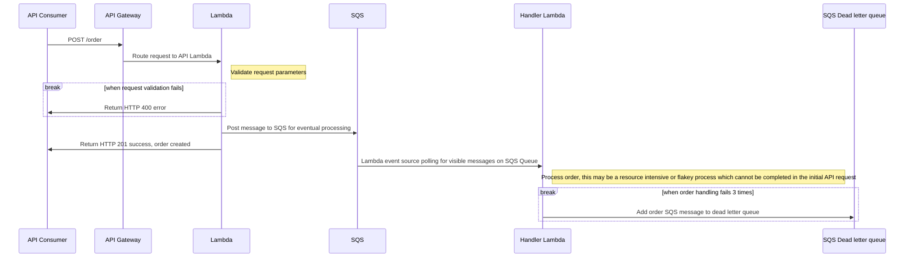

```mermaid
sequenceDiagram
    participant consumer as API Consumer
    participant APIGW as API Gateway
    participant API as Lambda
    participant SQS
    participant Handler as Handler Lambda
    participant SQSDLQ As SQS Dead letter queue

    consumer ->> APIGW: POST /order
    APIGW ->> API: Route request to API Lambda
    note right of API: Validate request parameters
    break when request validation fails
        API ->> consumer: Return HTTP 400 error
    end
    API ->> SQS: Post message to SQS for eventual processing
    API ->> consumer: Return HTTP 201 success, order created
    SQS ->> Handler: Lambda event source polling for visible messages on SQS Queue
    note right of Handler: Process order, this may be a resource intensive or flakey process which cannot be completed in the initial API request
    break when order handling fails 3 times
        Handler ->> SQSDLQ: Add order SQS message to dead letter queue
    end
```