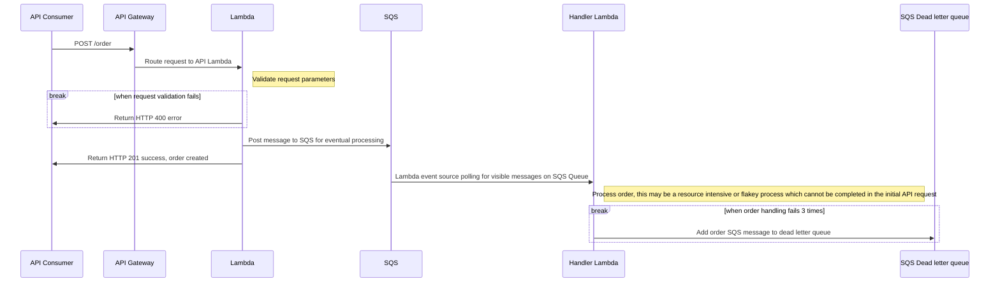

# AWS Lambda Queues

This is an example project shell of an AWS Architecture utilitsing the Serverless Framework with AWS Lambda written in TypeScript.

Architecture:



## Installation

Install project dependencies using Yarn

```bash
  yarn
```
    
## Environment Variables

To deploy this project to AWS, you will need to add the following environment variables to your environment.

`AWS_ACCESS_KEY_ID` An AWS account access key. It is not recommended to use your AWS Root user.

`AWS_SECRET_ACCESS_KEY` AWS secret access key


## Deploying

To deploy the project to AWS

```bash
  yarn deploy
```

## Development

To run the environment locally

```bash
  yarn dev
```
